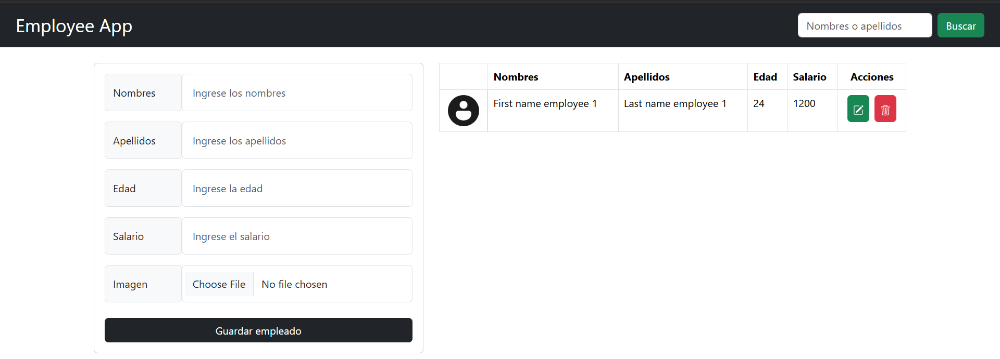
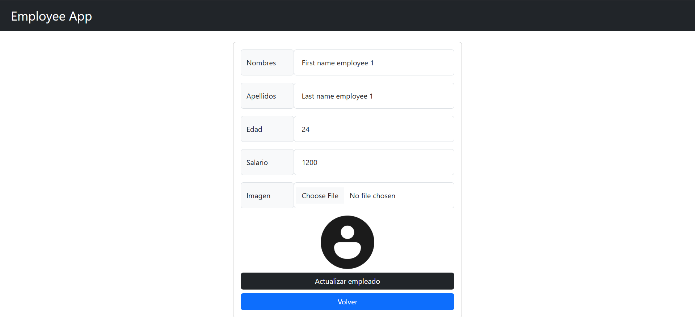
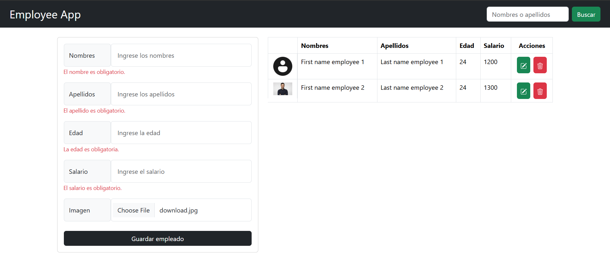

# Employee Management App (MEAN Stack)

This project is a simple Employee Management Application built using the MEAN (MongoDB, Express, Angular, Node.js) stack. It allows users to manage employee records, including adding, updating, deleting, and viewing employees.

## ✨ Features

- Create, read, update, and delete (CRUD) employee records
- RESTful API with Express.js and MongoDB
- Frontend built with Angular
- Backend with Node.js and Express.js
- Database managed with MongoDB

## 🚀 Installation

### Prerequisites

Make sure you have the following installed:

- [Node.js](https://nodejs.org/)
- [MongoDB](https://www.mongodb.com/)
- [Angular CLI](https://angular.io/cli)

### Steps

1. **Clone the repository**

   ```bash
   git clone https://github.com/Derek486/employee-app-mean-stack.git
   cd employee-app-mean-stack
   ```

2. **Install backend dependencies**

   ```bash
   cd backend
   npm install
   ```

3. **Set up the database**

   - Start MongoDB on your local machine or use a cloud service like MongoDB Atlas.
   - Update the MongoDB connection string in `backend/config/database.js` if necessary.

4. **Run the backend server**

   ```bash
   npm start
   ```

   The backend should now be running on `http://localhost:3000/`.

5. **Install frontend dependencies**

   ```bash
   cd ../frontend
   npm install
   ```

6. **Run the frontend**

   ```bash
   ng serve
   ```

   The frontend should now be running on `http://localhost:4200/`.

## 🌐 API Endpoints

- `GET /api/v1/employees` - Get all employees
- `POST /api/v1/employees` - Add a new employee
- `GET /api/v1/employees/:id` - Get an employee by ID
- `PUT /api/v1/employees/:id` - Update an employee
- `DELETE /api/v1/employees/:id` - Delete an employee

## 📸 Preview

Here are some screenshots of the project in action:

### Employee List


### Update Form


### Form with errors and new employee


## ⚖ License

This project is licensed under the MIT License - see the [LICENSE](LICENSE) file for details.

## 📌 Contribution

Feel free to fork the repository and contribute by submitting a pull request.